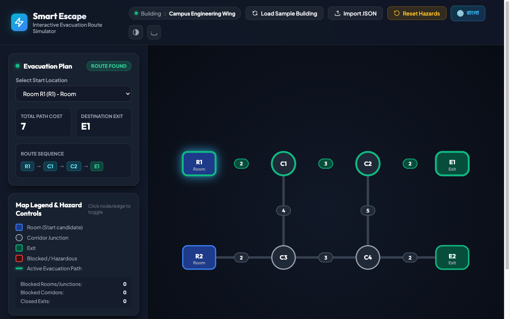
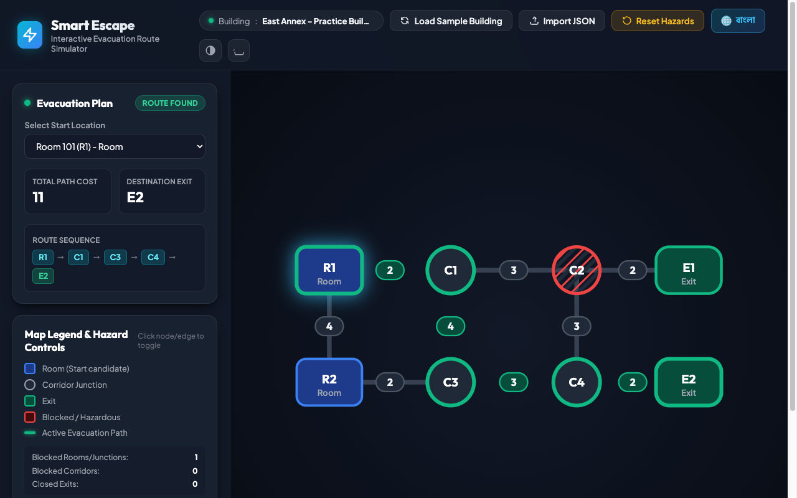
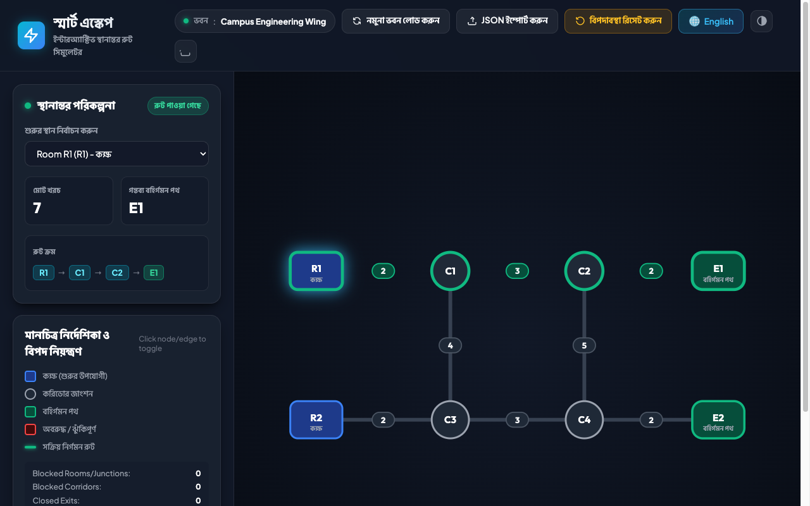

# Smart Escape - Interactive Evacuation Route Simulator

**AI DevFest Vibe-Coding Contest 2026**  
Daffodil International University (DIU) | Computer and Programming Club (CPC)

---

## 1. Participant Identity
- **Participant Name:** Fayek Ahanaf
- **Registration Number:** 252-16-056
- **Repository Name:** Vibe_Coding_Practice
- **Repository URL:** [https://github.com/dev-ahanaf/Vibe_Coding_Practice](https://github.com/dev-ahanaf/Vibe_Coding_Practice)
- **Live Public HTTPS Deployment:** [https://dev-ahanaf.github.io/Vibe_Coding_Practice/](https://dev-ahanaf.github.io/Vibe_Coding_Practice/)

---

## 2. Project Overview
**Smart Escape** is a high-performance, deterministic browser-based evacuation simulator that models real-time building hazards (blocked rooms, obstructed corridors, and closed emergency exits) and dynamically identifies the optimal minimum-cost evacuation path to an accessible exit.

Built with pure web standards (ES Modules, modern CSS, dynamic SVG) and zero runtime dependencies, Smart Escape runs completely in the browser without server-side computation or external routing APIs.

---

## 3. How to Run Locally

### Prerequisites
- Any modern web browser (Google Chrome 120+ recommended).
- Optional: Node.js (v18+) or Python (v3.9+) for running a local static server.

### Quick Start
1. **Clone the repository:**
   ```bash
   git clone https://github.com/dev-ahanaf/Vibe_Coding_Practice.git
   cd Vibe_Coding_Practice
   ```

2. **Serve locally:**
   - Using Python:
     ```bash
     python3 -m http.server 4173
     ```
   - Using Node (npx):
     ```bash
     npx serve -p 4173
     ```

3. **Open in Browser:**
   Navigate to `http://localhost:4173/` in Google Chrome.

### Running Automated Test Suite
The core routing and schema validation engines are completely decoupled from the DOM and can be verified via Node.js:
```bash
node test/test-runner.js
```
All 23 unit, tie-breaking, failure-state, and schema edge-case checks execute and report results directly to the console.

---

## 4. Main Features Implemented

1. **Schema & Input Validation (`logic/validate.js`):**
   - Validates all input constraints per Problem Statement §3.1: 2–60 nodes, 1–150 undirected edges, presence of rooms/junctions and exits.
   - Comprehensive checks for duplicate IDs, self-loops, repeated node pairs, non-positive edge costs, and category consistency in `initial_state`.
   - Clear, localized error alerts; never crashes on malformed data.
2. **Deterministic Multi-Level Routing Engine (`logic/route.js`):**
   - Dijkstra's shortest-path algorithm calculating exact cumulative edge cost.
   - Excludes blocked nodes and their incident corridors, blocked edges, and closed exits.
   - Strict tie-breaking per Problem Statement §3.3:
     1. Minimum total cost.
     2. Lexicographically smallest exit ID on cost tie.
     3. Lexicographically smallest sequence of node IDs on path tie.
3. **Dynamic Responsive SVG Building Map (`app.js`):**
   - Auto-scales to any unseen dataset coordinates via dynamic `viewBox` calculation.
   - Distinct visual styles for rooms (rounded rectangles), junctions (circular hubs), and exits (stadium badges).
   - Prominent corridor cost pill badges positioned at edge midpoints.
   - Illuminated glowing evacuation path with animated flow particles.
4. **Interactive Simulated Hazard Management:**
   - Interactive toggling: block/unblock rooms or junctions, block/unblock corridors, close/reopen exits.
   - Instant re-routing upon every state change without reimporting.
   - Reset button that restores the exact original `initial_state` from the imported file.
5. **Exact Failure State Messaging:**
   - Displays `"No route available"` when all exits are unreachable.
   - Displays `"Starting location blocked"` when the selected start node is blocked.
6. **Full Bilingual Support (Bangla & English):**
   - One-click language switch with centralized translation dictionary (`logic/i18n.js`).
   - Translates all headers, labels, metric cards, status badges, legend items, and error messages.
   - Preserves original dataset labels per Problem Statement §3.2.

---

## 5. Optional & Bonus Features Implemented
- **High Contrast Accessibility Mode:** Dedicated toggle for high-contrast viewing with sharpened borders and enhanced visibility.
- **PNG Map Export:** Exports the SVG building map as a high-resolution PNG image directly from the browser.
- **URL Parameter State Initialization:** Supports reproducible simulation states and bookmarking via query parameters (e.g., `?start=R1&blockNode=C2&lang=bn`).

---

## 6. Known Issues / Limitations
- Visual diagram corridor lengths are purely geometric representations based on coordinates and do not represent numeric travel costs (per Problem Statement §3.3).
- Large graphs with overlapping node coordinates rely on the author's input coordinate spacing.

---

## 7. AI Tools Used
- **Google Antigravity IDE (Gemini 3.8 Flash High):** Used for test-driven logic scaffolding, strict tie-breaking algorithm implementation, SVG map geometry calculation, and bilingual dictionary structuring.

---

## 8. Most Useful Prompt
> *"Implement deterministic Dijkstra routing for an undirected graph where edge cost is strictly the sum of edge costs. If multiple open exits tie on minimum cost, choose the lexicographically smallest exit ID; if paths to that exit also tie, choose the lexicographically smallest sequence of node IDs. Ensure the engine is decoupled from the DOM and fully runnable under Node.js."*

---

## 9. Verification & Screenshots

### Baseline Evacuation Route (`R1` → `E1`, Cost: 7)


### Rerouting After Blocking Junction `C2` (`R1` → `E2`, Cost: 11)


### Bilingual Interface: Bangla Mode (বাংলা ইন্টারফেস)


---

## 10. License
This project is licensed under the terms of the [MIT License](LICENSE).
